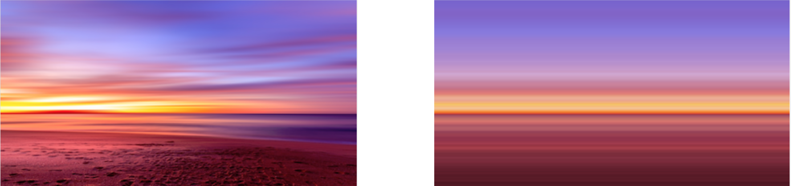

# Image2Gradient
Replicating images with CSS gradients



#### What is it?

Image2Gradient analyses colors in an image, and generates a CSS gradient that mimics the image.

Pictures *ahem* gradients speak a thousand words... so checkout the examples below :point_down: ... or read [how it works](#how-does-it-work).

#### Examples

Below each example is the cmd used to generate the gradient. *Image on the left, CSS gradient on the right* :wink: 


> `java Image2Gradient -f 500 -t l2r ../../../sample_images/building.jpg`


> `java Image2Gradient -f 500 ../../../sample_images/lake_sunset.jpg`


> `java Image2Gradient -f 500 ../../../sample_images/trees.jpg`

#### How does it work?

The algorithm divides an image into slices. The slice direction (vertical/horizontal/diagonal) determines the direction of the gradient. For instance... 

- Vertical dissections generate a `top-top-bottom` linear gradient.
- Horizontal dissections generate a `left-to-right` linear gradient.
- Diagonal dissections come in 2 forms:
	1. Bottom left to top right generates a `to top right` linear gradient.
	2. Bottom right to top left generates a `to top left` linear gradient.

After the dissection the average color in each slice is calculated and popped into a gradient. The number of slices correlates to [`color-stops`](https://developer.mozilla.org/en-US/docs/Web/CSS/linear-gradient#Values), and as we all know...

> Mo slices, Mo accurate gradients

For good measure the dominant color of the image is added to a background color. This provides a fallback to browsers that don't support linear gradients.  [Read here](#supported-browsers) for browser support.

#### User guide 

Download & navigate to class

```
git clone git@github.com:callum-hart/Image2Gradient.git
cd Image2Gradient/out/production/Image2Gradient
```

And run :runner:
 
 `java Image2Gradient [-optional_args] <image_path>`
 
#### CLI usage

###### Required args

| Arg | Description | Value 
| :---| :--- | :--- |
| **`<image_path>`** | Path to an image | Supported image types: **`PNG`** **`JPG`** **`JPEG`** **`BMP`** **`WBMP`** |
 
###### Optional args
 
| Flag | Description | Value | Default
| :---| :--- | :--- | :--- |
| **`-t`** | Type of linear gradient | <table><tr><td>t2b</td><td>*top to bottom*</td></tr><tr><td>l2r</td><td>*left to right*</td></tr><tr><td>bl2tr</td><td>*bottom left to top right*</td></tr><tr><td>br2tl</td><td>*bottom right to top left*</td></tr></table> | t2b |
| **`-f`** | Level of precision | Integer greater than or equal to 2 <br>*(higher number produces more accurate gradient)* | 10 |
| **`-v`** | Browser vendors to support | <table><tr><td>web</td><td>*Webkit*</td></tr><tr><td>moz</td><td>*Firefox*</td></tr><tr><td>opera</td><td>*Opera*</td></tr></table> | All |
| **`--help`** | Print CLI usage | n/a | n/a |

#### Supported browsers

- :white_check_mark: Chrome
- :white_check_mark: Firefox
- :white_check_mark: Safari
- :white_check_mark: Opera
- :white_check_mark: IE 10

Multi-browser support took more than prepending a few vendor prefixes (my original thought :thought_balloon:). Some intricacies I accounted for:

- Linear gradients with a vendor prefix drop the `to` keyword that precedes the gradient direction.
- The direction of horizontal gradients (with a prefix) reverses when there are more than 2 color stops :point_right: :point_left:.
- Image slices are reversed for bottom left to top right gradients.

But luckily, you needn't worry about these things... (unless theres a bug :bug: in which case please file an [issue](https://github.com/callum-hart/Image2Gradient/issues)) ... 

#### Use case~~s~~

Whilst waiting for an image to load show a placeholder gradient. This increases perceived speed, and improves UX on slower networks.

#### Resources

This isn't new territory. 

I first discovered this approach in Harry Roberts excellent blog post ["Improving Perceived Performance with Multiple Background Images"](http://csswizardry.com/2016/10/improving-perceived-performance-with-multiple-background-images/), and thought automating the process would be neat.

Since then others have also explored the topic, most notably:

- Ben Briggs ["postcss-resemble-image"](https://github.com/ben-eb/postcss-resemble-image) :computer: *(library)*
- Manuel Wieser ["Thoughts on Linear Gradients That Resemble Images"](https://manu.ninja/thoughts-on-linear-gradients-that-resemble-images) :newspaper: *(article)*

#### Stuff to keep the lawyers happy

- Licence: MIT
- Contributors: Very welcome!
 